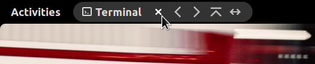

# Window Actions

Adds a Close button (among others) to the AppMenuButton.

This is a GNOME Shell extension.

## About This Extension

There are several extensions that hide the title bar when a window is maximized. This extension complements them by recovering some of the functionality that is hidden away in the window menu, or on the title bar itself.

The actions that are added:
- Close
- Move to Workspace Left
- Move to Workspace Right
- Always on Top
- Always on Visible Workspace

The actions that will *NOT* be added:
- Minimize -- there is no longer a Window List by default
- Maximize -- drag the window to the top of the screen
- Restore -- drag down from the Top Bar
- Shade -- does not work on Wayland apps
- Move -- no change, move the window as usual
- Resize -- no change, resize the window as usual

The code is inspired by https://github.com/PWall2222/WB.

## Test environment

- Fedora 35
- Wayland
- GNOME 41
- English

## Installation

1. Package the extension: `gnome-extensions pack --extra-source=prefs.ui .`
2. Install the extension: `gnome-extensions install window-actions@hum.per.sg.shell-extension.zip`
3. Restart GNOME Shell by logging out and back in
4. Enable the extension: `gnome-extensions enable window-actions@hum.per.sg`

## Uninstallation

1. Uninstall the extension: `gnome-extensions uninstall window-actions@hum.per.sg`
2. Restart GNOME Shell by logging out and back in

## Preferences

Show the preferences window: `gnome-extensions prefs window-actions@hum.per.sg`

Each button can be hidden individually.

The extension mode affects how much resource the extension will use:
| Mode | Description |
|:-----|:------------|
| Light | "Always on Top" and "Always on Visible Workspace" work like typical buttons. |
| Normal | If "Always on Top" and/or "Always on Visible Workspace" states are set, the corresponding toggles stay highlighted. The toggles are updated whenever the focus window changes. |
| Full | If "Always on Top" and/or "Always on Visible Workspace" states are set, the corresponding toggles stay highlighted. The toggles are updated whenever these states on the focus window change. Choose this mode if you also use the window menu to change the states; it ensures the toggles remain in sync in real time. |

After changing the mode, restart GNOME Shell for it to take effect.
